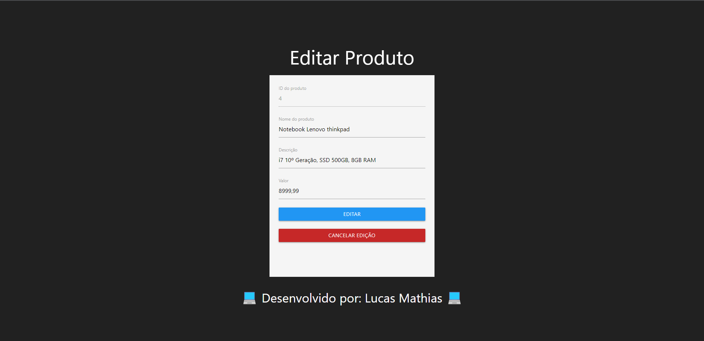
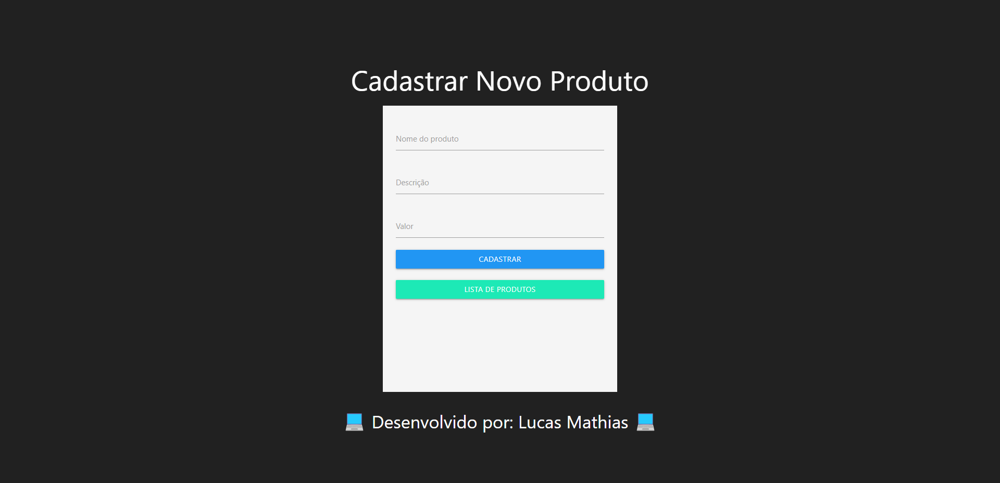

<h1 align="center">
   📦 <a href="#"> CRUD de Produtos Simples</a>
    
   </img>
</h1>

<h3 align="center">
    
</h3>

 <a href="#sobre">Sobre</a> •
 <a href="#como-funciona">Como funciona</a> •
 <a href="#feito-com">Feito com</a> • 
 <a href="#autor">Autor</a> 

## Sobre

Projeto desenvolvido com intuito de exercitar conhecimentos nas linguagens PHP e SQL em cima do conceito de CRUD

* Create (Inserir/Criar dados)
* Read (Selecionar/Ler dados)
* Update (Atualizar dados existentes)
* Delete (Excluir dados)

 

## Como funciona

Na tela principal ficarão listados todos os prdutos existentes no banco de dados. Nela podemos excluir ou editar qualquer registro, e também inserir um novo registro

Nesse projeto eu utilizei o banco de dados SQLite e a Classe PDO do PHP para interagir com o banco

## Feito com

    
    
     
    

## Autor

<a href="https://github.com/lucasMSF">
 
  
 <b>Lucas Mathias</b></a> 
  

